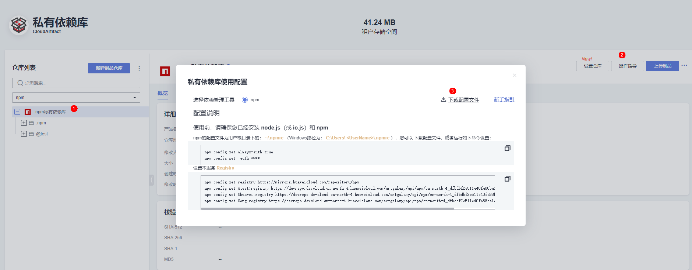

# npm CloudArtifact Action
私有依赖库(CloudArtifact)是发布服务（[CloudRelease](https://support.huaweicloud.com/cloudrelease/index.html)）的语言软件仓库功能。用于管理私有组件（开发者通俗称之为私服），包括Maven、Npm、Go、PyPI、Rpm等多种仓库格式。 
npm CloudArtifact Action会创建用户npm配置文件.npmrc文件(~/.npmrc),目前支持npm仓库源(registry_list)和仓库认证信息(auth_list)配置，用户后续的workflow步骤可以直接从CloudArtifact npm私有依赖库上传下载依赖组件。

## **前置工作**
(1)[新建私有依赖库](https://support.huaweicloud.com/usermanual-releaseman/cloudrelease_01_0008.html)  
(2)[管理用户权限](https://support.huaweicloud.com/usermanual-releaseman/cloudrelease_01_0011.html)

## **参数说明**
私有依赖库CloudArtifact 参数获取来源：[私有依赖库首页](https://devcloud.cn-north-4.huaweicloud.com/cloudartifact/repository)->点击需要的npm仓库->右上角操作指导->点击下载配置文件->npm配置在下载的npmrc文件当中  


### `registry_list`
npm registry列表。  npm registry有两种方式，不包含@scope和包含@scope的仓库。华为云CloudArtifact npm仓库目前是包含@scope的方式。npm 支持含scope的方式配置多仓库，不包含scope只能配置一个仓库。
两种配置方式如下：
```
registry=https://mirrors.huaweicloud.com/repository/npm/
@test:registry=https://devrepo.devcloud.cn-north-4.huaweicloud.com/artgalaxy/api/npm/cn-north-4_xxx_npm_0/
```
Reference:  [npm registry](https://docs.npmjs.com/cli/v6/using-npm/registry)

### `auth_list`
npm仓库认证配置。也分为不包含@scope和包含@scope。  
a. 不带@scope上传  
样式: _auth=(user:password).base64  
用户名和密码中间用冒号隔开，通过base64编码后的字符串。假如用户名为:test，密码为:123。dGVzdDoxMjM= 是test:123的base64编码
.npmrc配置结果如下：
```
_auth=dGVzdDoxMjM=
```
b.带@scope上传，若@scope为"@cloud"  
样式: //npm仓库地址/:_auth=(username:password).base64
假如npm仓库地址:devrepo.devcloud.cn-north-4.huaweicloud.com/artgalaxy/api/npm/cn-north-4_xxx_npm_0  
用户名为: test  
密码为: 123  
dGVzdDoxMjM= 是test:123base64编码  
.npmrc配置结果如下：

```
//devrepo.devcloud.cn-north-4.huaweicloud.com/artgalaxy/api/npm/cn-north-4_xxx_npm_0/:_auth=dGVzdDoxMjM=
```
<sup>Secrets variables can be configured on repository settings > Secrets</sup>

## **使用样例**
### 1.默认不传参数样例
```yml
steps:
- uses: huaweicloud/npm-cloudartifact-action@v1.0.0
```
如果参数registry_list为空或者不填，.npmrc文件添加maven中心仓
.npmrc输出结果
```
registry=https://registry.npmjs.org/
```
### 2.公开npm仓库使用样例
```yml
steps:
- uses: huaweicloud/npm-cloudartifact-action@v1.0.0
  with: 
    registry_list: |
        registry=https://mirrors.huaweicloud.com/repository/npm/
```
.npmrc输出结果
```
registry=https://mirrors.huaweicloud.com/repository/npm/
```
### 3.不带@scope npm仓库使用样例
```yml
steps:
- uses: huaweicloud/npm-cloudartifact-action@v1.0.0
  with: 
    registry_list: |
        registry=https://devrepo.devcloud.cn-north-4.huaweicloud.com/artgalaxy/api/npm/cn-north-4_xxxxx_npm_0/
    auth_list: |
        _auth=${{ secrets.NPM_AUTH }}
```
.npmrc输出结果
```
registry=https://devrepo.devcloud.cn-north-4.huaweicloud.com/artgalaxy/api/npm/cn-north-4_xxxxx_npm_0/
_auth=*****
```
### 4.带@scope npm仓库使用样例
```yml
steps:
- uses: huaweicloud/npm-cloudartifact-action@v1.0.0
  with: 
    registry_list: |
        @test:registry=https://devrepo.devcloud.cn-north-4.huaweicloud.com/artgalaxy/api/npm/cn-north-4_xxxxx_npm_0/
    auth_list: |
        //devrepo.devcloud.cn-north-4.huaweicloud.com/artgalaxy/api/npm/cn-north-4_xxxxx_npm_0/:_auth=${{ secrets.NPM_AUTH }}
```
.npmrc输出结果
```
@test:registry=https://devrepo.devcloud.cn-north-4.huaweicloud.com/artgalaxy/api/npm/cn-north-4_xxxxx_npm_0/
//devrepo.devcloud.cn-north-4.huaweicloud.com/artgalaxy/api/npm/cn-north-4_xxxxx_npm_0/:_auth=*****
```
### 5.配置多仓库使用样例
```yml
steps:
- uses: huaweicloud/npm-cloudartifact-action@v1.0.0
  with: 
    registry_list: |
      registry=https://mirrors.huaweicloud.com/repository/npm/
      @test:registry=https://devrepo.devcloud.cn-north-4.huaweicloud.com/artgalaxy/api/npm/cn-north-4_xxxxx_npm_0/
      @cloud:registry=https://devrepo.devcloud.cn-north-4.huaweicloud.com/artgalaxy/api/npm/cn-north-4_xxxxx_npm_1/
    auth_list: |
      //devrepo.devcloud.cn-north-4.huaweicloud.com/artgalaxy/api/npm/cn-north-4_xxxxx_npm_0/:_auth=${{ secrets.NPM_AUTH_0 }}
      //devrepo.devcloud.cn-north-4.huaweicloud.com/artgalaxy/api/npm/cn-north-4_xxxxx_npm_1/:_auth=${{ secrets.NPM_AUTH_1 }}
```
.npmrc输出结果
```
registry=https://mirrors.huaweicloud.com/repository/npm/
@test:registry=https://devrepo.devcloud.cn-north-4.huaweicloud.com/artgalaxy/api/npm/cn-north-4_xxxxx_npm_0/
@cloud:registry=https://devrepo.devcloud.cn-north-4.huaweicloud.com/artgalaxy/api/npm/cn-north-4_xxxxx_npm_1/
//devrepo.devcloud.cn-north-4.huaweicloud.com/artgalaxy/api/npm/cn-north-4_xxxxx_npm_0/:_auth=*****
//devrepo.devcloud.cn-north-4.huaweicloud.com/artgalaxy/api/npm/cn-north-4_xxxxx_npm_1/:_auth=*****
```
详细的demo使用样例可以参考[npm-cloudartifact-workflow-samples](https://github.com/huaweicloud/npm-cloudartifact-workflow-samples)

## 公网域名说明
```
npm官方镜像源：'https://registry.npmjs.org'
```
